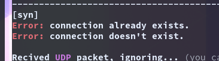

# pyTCP
Low level implementation of the TCP protocol in python using TunTap virtual network interface on linux.

**Based on:**
  * The official TCP specifications [RFC 793](https://tools.ietf.org/html/rfc793#page-19)
  * [This](https://github.com/jonhoo/rust-tcp) great repository and video series
  * [This](https://github.com/gonewind73/pytuntap) nice, but unfortunately not maintained package

**Useful links:**
  * [TCP on Wikipedia](https://en.wikipedia.org/wiki/Transmission_Control_Protocol)
  * [IPv4 on Wikipedia](https://en.wikipedia.org/wiki/IPv4)
  * Official IP specifications [RFC 760](https://tools.ietf.org/html/rfc760)
  * ICMP specifications [RFC 792](https://tools.ietf.org/html/rfc792)

**Note:** The RFC 793 specification was written without object oriented programming in mind. Although I
*can* code it in python I really don't *want* to. This is why this implementation is more 
*in the spirit* of RFC 793 rather than a real big boy full on implementation. So, for example,
a connection is an object rather than an element in the TCB (and the TCB should be accessed 
with a pointer to it).

In case you are wondering how well does this work, let me answer that with an image:



I always need this on hand so I put it here for convenience

**State flow diagram**
```
                              +---------+ ---------\      active OPEN
                              |  CLOSED |            \    -----------
                              +---------+<---------\   \   create TCB
                                |     ^              \   \  snd SYN
                   passive OPEN |     |   CLOSE        \   \
                   ------------ |     | ----------       \   \
                    create TCB  |     | delete TCB         \   \
                                V     |                      \   \
                              +---------+            CLOSE    |    \
                              |  LISTEN |          ---------- |     |
                              +---------+          delete TCB |     |
                   rcv SYN      |     |     SEND              |     |
                  -----------   |     |    -------            |     V
 +---------+      snd SYN,ACK  /       \   snd SYN          +---------+
 |         |<-----------------           ------------------>|         |
 |   SYN   |                    rcv SYN                     |   SYN   |
 |   RCVD  |<-----------------------------------------------|   SENT  |
 |         |                    snd ACK                     |         |
 |         |------------------           -------------------|         |
 +---------+   rcv ACK of SYN  \       /  rcv SYN,ACK       +---------+
   |           --------------   |     |   -----------
   |                  x         |     |     snd ACK
   |                            V     V
   |  CLOSE                   +---------+
   | -------                  |  ESTAB  |
   | snd FIN                  +---------+
   |                   CLOSE    |     |    rcv FIN
   V                  -------   |     |    -------
 +---------+          snd FIN  /       \   snd ACK          +---------+
 |  FIN    |<-----------------           ------------------>|  CLOSE  |
 | WAIT-1  |------------------                              |   WAIT  |
 +---------+          rcv FIN  \                            +---------+
   | rcv ACK of FIN   -------   |                            CLOSE  |
   | --------------   snd ACK   |                           ------- |
   V        x                   V                           snd FIN V
 +---------+                  +---------+                   +---------+
 |FINWAIT-2|                  | CLOSING |                   | LAST-ACK|
 +---------+                  +---------+                   +---------+
   |                rcv ACK of FIN |                 rcv ACK of FIN |
   |  rcv FIN       -------------- |    Timeout=2MSL -------------- |
   |  -------              x       V    ------------        x       V
    \ snd ACK                 +---------+delete TCB         +---------+
     ------------------------>|TIME WAIT|------------------>| CLOSED  |
                              +---------+                   +---------+
```

**TCP header**
```
 TCP Header Format


    0                   1                   2                   3
    0 1 2 3 4 5 6 7 8 9 0 1 2 3 4 5 6 7 8 9 0 1 2 3 4 5 6 7 8 9 0 1
   +-+-+-+-+-+-+-+-+-+-+-+-+-+-+-+-+-+-+-+-+-+-+-+-+-+-+-+-+-+-+-+-+
   |          Source Port          |       Destination Port        |
   +-+-+-+-+-+-+-+-+-+-+-+-+-+-+-+-+-+-+-+-+-+-+-+-+-+-+-+-+-+-+-+-+
   |                        Sequence Number                        |
   +-+-+-+-+-+-+-+-+-+-+-+-+-+-+-+-+-+-+-+-+-+-+-+-+-+-+-+-+-+-+-+-+
   |                    Acknowledgment Number                      |
   +-+-+-+-+-+-+-+-+-+-+-+-+-+-+-+-+-+-+-+-+-+-+-+-+-+-+-+-+-+-+-+-+
   |  Data |           |U|A|P|R|S|F|                               |
   | Offset| Reserved  |R|C|S|S|Y|I|            Window             |
   |       |           |G|K|H|T|N|N|                               |
   +-+-+-+-+-+-+-+-+-+-+-+-+-+-+-+-+-+-+-+-+-+-+-+-+-+-+-+-+-+-+-+-+
   |           Checksum            |         Urgent Pointer        |
   +-+-+-+-+-+-+-+-+-+-+-+-+-+-+-+-+-+-+-+-+-+-+-+-+-+-+-+-+-+-+-+-+
   |                    Options                    |    Padding    |
   +-+-+-+-+-+-+-+-+-+-+-+-+-+-+-+-+-+-+-+-+-+-+-+-+-+-+-+-+-+-+-+-+
   |                             data                              |
   +-+-+-+-+-+-+-+-+-+-+-+-+-+-+-+-+-+-+-+-+-+-+-+-+-+-+-+-+-+-+-+-+
```

**IP header**
```
 0                   1                   2                   3
    0 1 2 3 4 5 6 7 8 9 0 1 2 3 4 5 6 7 8 9 0 1 2 3 4 5 6 7 8 9 0 1
   +-+-+-+-+-+-+-+-+-+-+-+-+-+-+-+-+-+-+-+-+-+-+-+-+-+-+-+-+-+-+-+-+
   |Version|  IHL  |Type of Service|          Total Length         |
   +-+-+-+-+-+-+-+-+-+-+-+-+-+-+-+-+-+-+-+-+-+-+-+-+-+-+-+-+-+-+-+-+
   |         Identification        |Flags|      Fragment Offset    |
   +-+-+-+-+-+-+-+-+-+-+-+-+-+-+-+-+-+-+-+-+-+-+-+-+-+-+-+-+-+-+-+-+
   |  Time to Live |    Protocol   |         Header Checksum       |
   +-+-+-+-+-+-+-+-+-+-+-+-+-+-+-+-+-+-+-+-+-+-+-+-+-+-+-+-+-+-+-+-+
   |                       Source Address                          |
   +-+-+-+-+-+-+-+-+-+-+-+-+-+-+-+-+-+-+-+-+-+-+-+-+-+-+-+-+-+-+-+-+
   |                    Destination Address                        |
   +-+-+-+-+-+-+-+-+-+-+-+-+-+-+-+-+-+-+-+-+-+-+-+-+-+-+-+-+-+-+-+-+
   |                    Options                    |    Padding    |
   +-+-+-+-+-+-+-+-+-+-+-+-+-+-+-+-+-+-+-+-+-+-+-+-+-+-+-+-+-+-+-+-+
```

Works only on linux. Need to run as sudo unless you set the `tun` device in `/dev/net/` to be accessible by non-root users (i.e. `chmod 0666 /dev/net/tun`).

